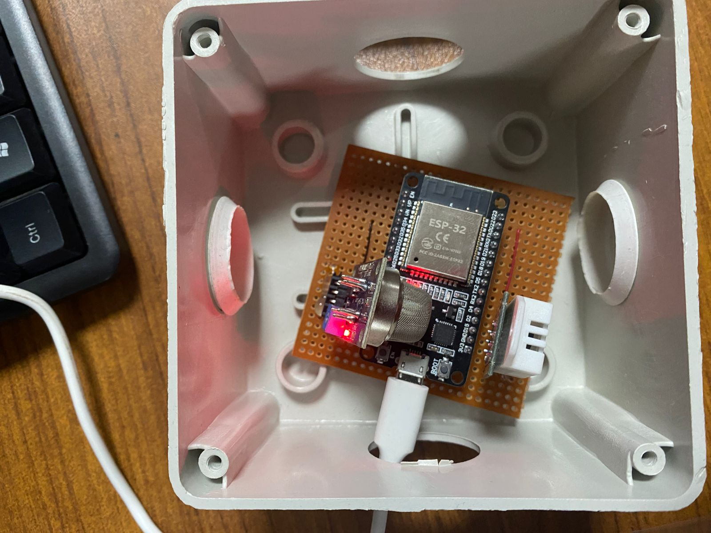
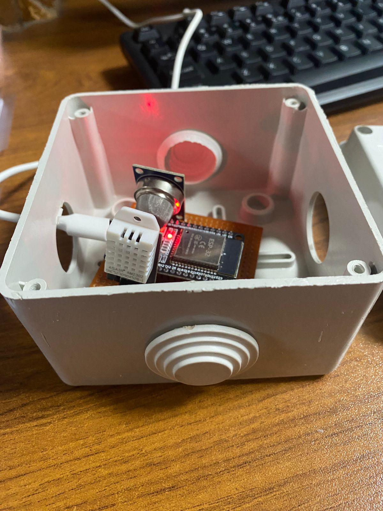

# Air Quality Monitor (ESP32 + Django)
### This is an IOT base Air quality monitoring system, which uses ESP32 microcontroller to collect data from sensors such as DHT22 and MQ135 to send it over to the Django server. Django backend provides a interactive Web interface with OTA (Over-The-Air) firmware updates support for ESP32.

